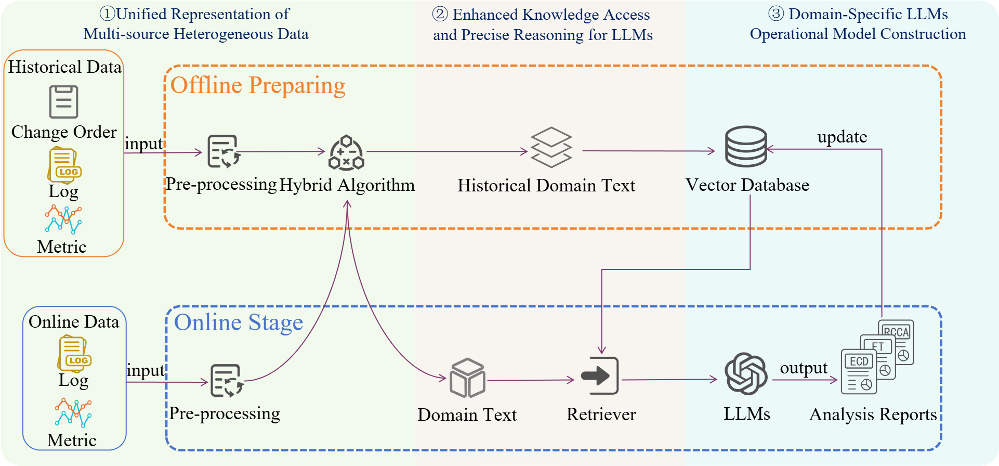

# NKAIOps-SoftwareChange

Repository of SCELM, SoftwareChange Project from AIOps Lab, Nankai University.

Repo & Funtion Code maintained by [Weihua Kuang](https://github.com/waywooKwong).

Further deployment  in enterprise by Hailin Zhang.

## News

:star: 2025/03/25: Our Paper **A Multimodal Intelligent Change Assessment Framework for Microservice
Systems Based on Large Language Models** (SCELM) accepted by FSE 2025 Industry!

2025/03/10: Test & Deploy SCELM on ByteDance enterprise data.

2025/01/23: Paper submission to FSE 2025.

2025/01/10: Refactor code.

... : more detailed depolyment tutorials comming soon!

## About

Using Large Language Model to improve efficiency of software change maintainance.

Yun Zhanghu Technology

## Environment

### Tools

- Ollama, deploy models on local server

  recommended gemma2-9b, qwen2.5-7b,llama3.1-7b
- Redis

### Models

- m3e-base, vector embeeding model.
- all-MiniLM-L6-v2, semantic similarity matching model.

## How to run

### 1. Run Ollama server

### 2. Run Redis server

### 3. Run code

1. Part1_AreaText-Generate

   Generate areatext according to change information.
2. Part2_LLM-Generate

   Change analysis by LLM using Retriever-Augmented Generation.

## Contributions

LLM-RAG part code & experiment design by Weihua Kuang,

Baseline experiment by ShenChao,

Co-guided & Mainly Paper writing by other writers.
